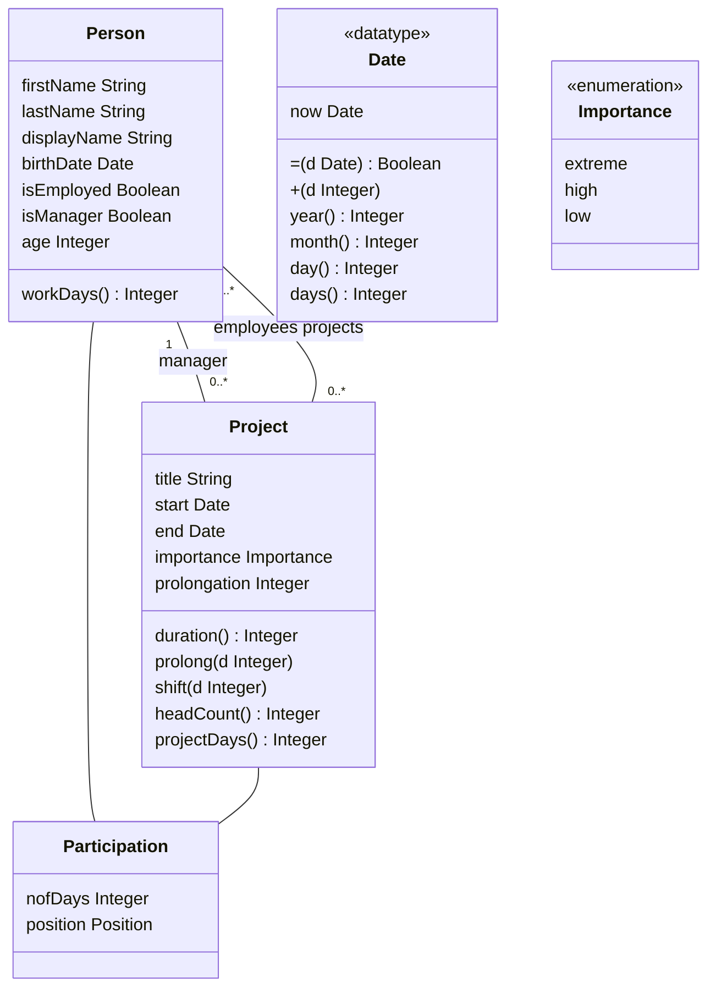

# Example given in course slides

```mermaid
classDiagram
    Person "1" -- "0..*" Project : manager
    Person "1..*" -- "0..*" Project : employees projects
    Person -- Participation
    Project -- Participation

    class Person {
        firstName String
        lastName String
        displayName String
        birthDate Date
        isEmployed Boolean
        isManager Boolean
        age Integer
        workDays() Integer
    }

    class Project {
        title String
        start Date
        end Date
        importance Importance
        prolongation Integer
        duration() Integer
        prolong(d Integer)
        shift(d Integer)
        headCount() Integer
        projectDays() Integer
    }

    class Date {
        <<datatype>>
        now Date
        =(d Date) Boolean
        +(d Integer)
        year() Integer
        month() Integer
        day() Integer
        days() Integer
    }

    class Participation {
        nofDays Integer
        position Position
    }

    class Importance {
        <<enumeration>>
        extreme
        high
        low
    }
```
