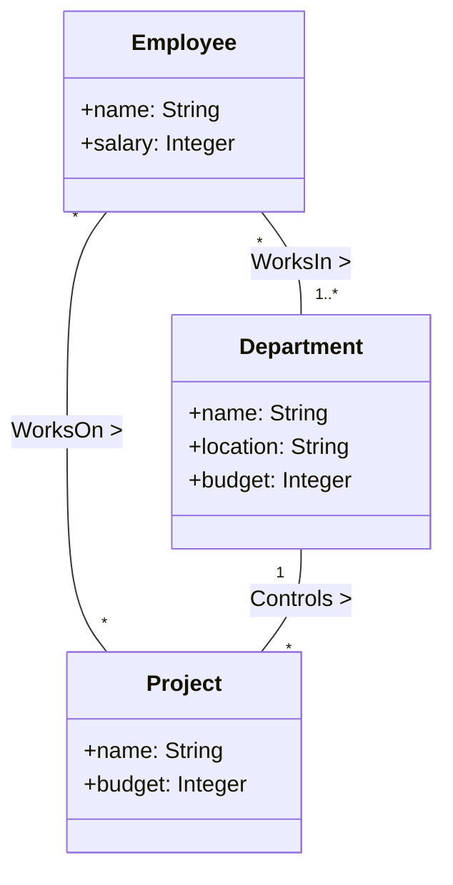

# Notes on the USE tool overview

<https://www.db.informatik.uni-bremen.de/projects/USE/qt.html>

- We use OCL to extend the UML class diagram by adding constraints to it. We start with natural language constraints and then define define them formally.

Constraints:

- The number of employees working in a department must be greater or equal to the number of projects controlled by the department.
- Employees get a higher salary when they work on more projects.
- The budget of a project must not exceed the budget of the controlling department.
- Employees working on a project must also work in the controlling department.

Specification:

- USE seeks to interactively validate the above model and its constraints. Validity is checked in each system state.
- Use expects a textual representation of the class diagram
