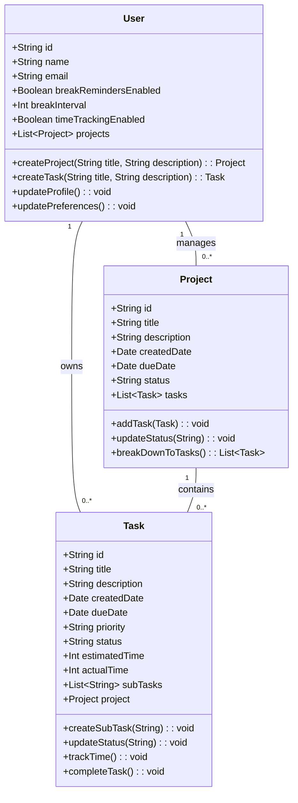

# Project class diagram

```mermaid

classDiagram
    class User {
        +String id
        +String name
        +String email
        +Boolean breakRemindersEnabled
        +Int breakInterval
        +Boolean timeTrackingEnabled
        +List~Project~ projects
        +createProject(String title, String description) : Project
        +createTask(String title, String description) : Task
        +updateProfile() : void
        +updatePreferences() : void
    }

    class Project {
        +String id
        +String title
        +String description
        +Date createdDate
        +Date dueDate
        +String status
        +List~Task~ tasks
        +addTask(Task) : void
        +updateStatus(String) : void
        +breakDownToTasks() : List~Task~
    }

    class Task {
        +String id
        +String title
        +String description
        +Date createdDate
        +Date dueDate
        +String priority
        +String status
        +Int estimatedTime
        +Int actualTime
        +List~String~ subTasks
        +Project project
        +createSubTask(String) : void
        +updateStatus(String) : void
        +trackTime() : void
        +completeTask() : void
    }

    %% Relationships
    User "1" -- "0..*" Project : manages
    User "1" -- "0..*" Task : owns
    Project "1" -- "0..*" Task : contains

```
